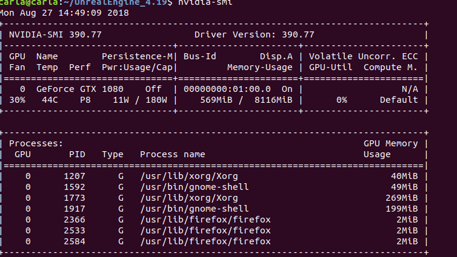
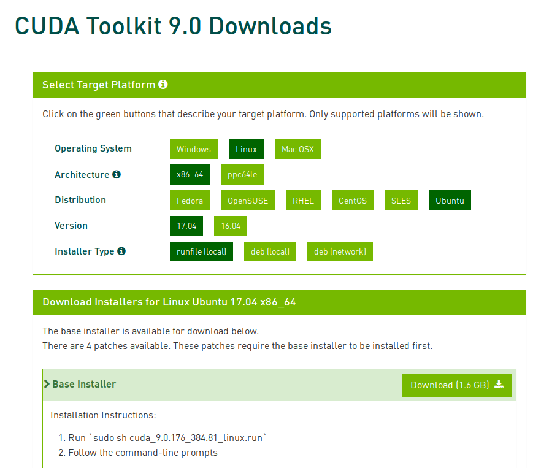
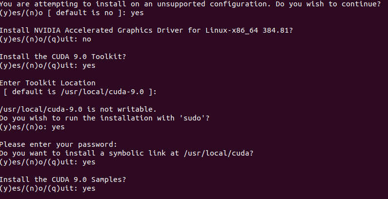

# Tensorflow-gpu on Ubuntu 18.04

I wrote this post to simplify the  installation process of gpu version of TensorFlow on Ubuntu 18.04. I have described few installation steps here and hope that it will be helpful.

## NVIDIA driver
Check the nvidia driver is installed by running the command 'nvidia-smi'. Normally, the command will be installed as part of the driver and expected to get the result below.



If you are not able to see the result like above picture, it may be due to either nvidia driver is not installed or nvidia-smi utility is missing. I had to run the below to install the nvidia driver and was successful with installation. 
#### Only follow below steps if you can't get information like above or driver is too old.

* Run the below code to uninstall the existing nvidia driver and restart.
```
sudo apt-get purge nvidia*  
sudo reboot
```
* Run the below code to install the nvidia driver 390 at the time of this post writing.
```
sudo apt-get install nvidia-390
```
After these steps, you have installed the nvidia driver and 'nvidia-smi' commad should give you some information about the GPU.

## CUDA 9.0 installation 
* Download cuda9.0 installation file

* Change the permission of the downloaded file

```
sudo chmod +x cuda_9.0.176_384.81_linux.run
```

* The run the file

```
./cuda_9.0.176_384.81_linux.run
```

Accept the terms and condition and make sure you type 'no' to the accelerated graphics driver installation question. Also make sure type 'yes' to symoblic link question.

