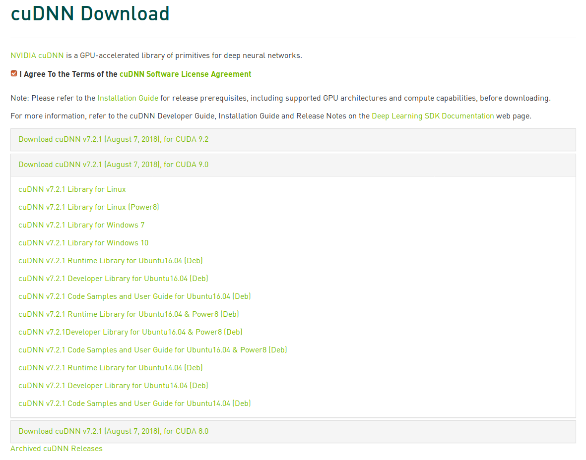

# Tensorflow-gpu on Ubuntu 18.04

I wrote this post to simplify the  installation process of gpu version of TensorFlow on Ubuntu 18.04. I have described few installation steps here and hope that it will be helpful.

## NVIDIA driver
Check the nvidia driver is installed by running the command 'nvidia-smi'. Normally, the command will be installed as part of the driver and expected to get the result below.


If you are not able to see the result like above picture, it may be due to either nvidia driver is not installed or nvidia-smi utility is missing. I had to run the below to install the nvidia driver and was successful with installation. 
#### Only follow below steps if you can't get information like above or driver is too old.

* Run the below code to uninstall the existing nvidia driver and restart.
```
sudo apt-get purge nvidia*  
sudo reboot
```
* Run the below code to install the nvidia driver 390 at the time of this post writing.
```
sudo apt-get install nvidia-390
```
After these steps, you have installed the nvidia driver and 'nvidia-smi' commad should give you some information about the GPU.

## CUDA 9.0 installation 

* Download cuda9.0 installation file from [nvidia site](https://developer.nvidia.com/cuda-90-download-archive?target_os=Linux&target_arch=x86_64&target_distro=Ubuntu&target_version=1704&target_type=runfilelocal).


* Change the permission of the downloaded file

```
sudo chmod +x cuda_9.0.176_384.81_linux.run
```

* The run the file

```
./cuda_9.0.176_384.81_linux.run
```

Accept the terms and condition and make sure you type 'no' to the accelerated graphics driver installation question. Also make sure type 'yes' to symoblic link question.


## CUDANN 7.2.1 installation

Next, Download the file from [nvidia site](https://developer.nvidia.com/rdp/cudnn-download#a-collapse721-9).



Please make sure you have downloaded the first option cuDNN v7.2.1 Library for Linux.
Once you have downloaded, follow the below steps:
* Extract and copy
```
sudo tar -xzvf 
sudo cp cuda/include/cudnn.h /usr/local/cuda/include
sudo cp cuda/lib64/libcudnn* /usr/local/cuda/lib64
sudo chmod a+r /usr/local/cuda/include/cudnn.h 
sudo chmod a+r /usr/local/cuda/lib64/libcudnn*
```
* Copy below commands to ~/.bashrc
```
export LD_LIBRARY_PATH="$LD_LIBRARY_PATH:/usr/local/cuda/lib64:/usr/local/cuda/extras/CUPTI/lib64"
export CUDA_HOME=/usr/local/cuda
export PATH="$PATH:/usr/local/cuda/bin"
```
* Run the below command to source
```
source ~/.bashrc
```

## Miniconda installation
At this stage we have installed all the required software for Tensorflow gpu version to work. Now, we need to install the miniconda software that will enable us to create python virtual environments. 
```
wget https://repo.continuum.io/miniconda/Miniconda3-latest-Linux-x86_64.sh
bash Miniconda3-latest-Linux-x86_64.sh
```
During the installation, it will be asked to append the path to ~/.bahrc and type yes to append them.

## Tensorflow gpu installation
Finally, we are ready to install the gpu version of Tensorflow. We need to run below steps to get there:
* Create virtual environment. 
```
conda create -n tensorflow_gpu
```
* Get into the environment
```
source activate tensorflow_gpu
```
* Install tensorflow-gpu
```
pip install tensorflow-gpu
```
* Check the installation by create a file called 'test.py' and add below commands to it
```
import tensorflow as tf   

hello = tf.constant('Hello there!')

print(sess.run(hello))
```
* Run 'python test. py' and you should be able to get 'Hello there!' message that is he indication gpu version tensorflow has been installed successfully. Otherwise, Installation failed.

